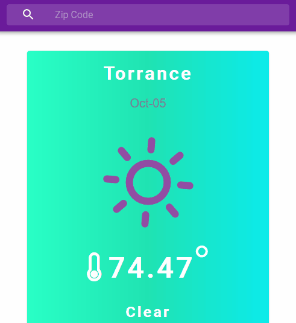

# Weather App with React & Redux
> It's a simple weather app built with React & Redux

* [weatherRedux](https://april9288.github.io/weatherRedux/) - Check your location's current weather!



## Getting Started

### Prerequisites

If you don't have Node.js setup on your computer, please click below link and download it first.

* [Node.js](https://nodejs.org/en/) - The official Node.js website to download

### Installing

If you already have Node.js, then follow below step.

On your terminal:

```
cd /c/<folder_path>
git clone https://github.com/april9288/weatherRedux.git
cd weatherRedux
npm install
npm start

```

So it will automatically run in your local server.

## Built with

* [React.js](https://reactjs.org/) - The official React.js website
* [Redux.js](https://redux.js.org/) - It's a Javascript library helps manage React state
* [Google Geolocation API](https://google.com) - It returns latitude and longitude
* [Dark Sky Weather API](https://darksky.net) - It returns weather data
* [Recharts](http://recharts.org/en-US/) - It's a libarary for rendering charts with React.js
* [Material UI](https://material-ui.com/) - It's a design framework made by Google

## Unit Test with

* [jest]
* [enzyme]
* [enzyme-adapter-react-16]
* [fetch-mock] 
* [moxios]
* [redux-mock-store]

## Meta

James Jongho Kim 
- [Github](https://github.com/april9288) - This is my Github page
- [Linkedin](https://www.linkedin.com/in/jongho-kim-b05618170/) - This is my Linkedin page
- april9288@gmail.com